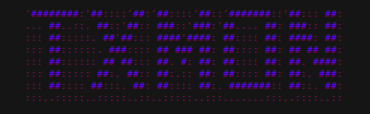

<p align="center">
  
</p>

An automated script for interacting with Monad blockchain dApps and smart contracts. This tool helps you automate interact on Monad dApps.


## Features

- 🔄 Automated token swaps on Monadex
- 🏦 Easy staking on multiple protocols (Aprio, Shmonad)
- 🤖 Command-line interface for easy interactions
- 🔐 Secure private key management through .env files

## Prerequisites

Before you begin, ensure you have the following installed:

- [Node.js](https://nodejs.org/) (v16.x or higher)
- [npm](https://www.npmjs.com/) (v8.x or higher)
- A Monad wallet with MON tokens

## Installation

1. Clone the repository:

```bash
git clone https://github.com/zaapr0x/txMON.git
cd txMON
```

2. Install dependencies:

```bash
npm install
```

3. Set up your environment variables:

```bash
cp .env.sample .env
```

4. Edit the `.env` file and add your private key:

```
PRIVATE_KEY=your_private_key_here
```

> ⚠️ **SECURITY WARNING**: Never share your `.env` file or commit it to public repositories. The `.env` file is included in `.gitignore` by default.

## Usage

To start the script, run:

```bash
node index.js
```

### Menu Options

The script provides a simple menu with the following options:

1. **Start Scripts** - Run all automated interactions (Monadex swaps and staking)
2. **List Supported Dapps** - Show all supported dApps and websites
3. **Exit** - Close the application

## Supported DApps

The table below shows all currently supported and planned DApps for the txMON script:

| Name    | Website                                                      | Category      | Features    | Status     |
| ------- | ------------------------------------------------------------ | ------------- | ----------- | ---------- |
| Monadex | [https://app.monadex.exchange](https://app.monadex.exchange) | DEX           | Token swaps | ✅ Active  |
| Aprio   | [https://stake.apr.io](https://stake.apr.io)                 | Staking (LSD) | MON staking | ✅ Active  |
| Shmonad | [https://www.shmonad.xyz](https://www.shmonad.xyz)           | Staking (LSD) | MON staking | ✅ Active  |
| Kuru    | [https://www.monaswap.io](https://www.kuru.io)               | DEX           | Token swaps | 🔜 Planned |

## Configuration

The script uses contract ABIs stored in the `src/abi/` directory. Each contract should have its own JSON file with the following structure:

## Technical Details

- The script uses Web3.js to interact with the Monad blockchain
- Default transaction values:
  - Swap/Stake amount: 0.01 MON
  - Gas price: Automatically determined
  - Gas limit: Automatically estimated + 10% buffer

## Troubleshooting

### Common Issues

1. **Transaction Failed**

   - Ensure you have enough MON for gas fees
   - Check your network connection
   - Verify contract addresses are correct

2. **Contract Not Found**

   - Ensure all contract ABIs are properly formatted in `src/abi/`

3. **Private Key Error**
   - Check that your `.env` file exists and contains the correct private key

## Contributing

Contributions are welcome! Please feel free to submit a Pull Request.

1. Fork the project
2. Create your feature branch (`git checkout -b feature/amazing-feature`)
3. Commit your changes (`git commit -m 'Add some amazing feature'`)
4. Push to the branch (`git push origin feature/amazing-feature`)
5. Open a Pull Request

## Acknowledgements

- [Web3.js](https://web3js.readthedocs.io/)
