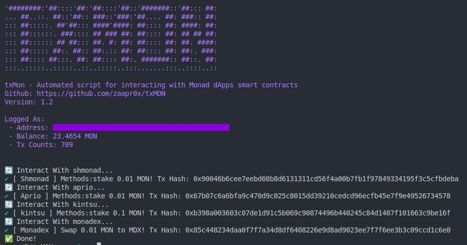

<p align="center">
  
</p>

# txMON

**txMON** is an automated script for interacting with Monad blockchain dApps and smart contracts. This tool simplifies and automates interactions with Monad-based dApps.


## Preview

<p align="center">
  
</p>
## 🚀 Features

- 🔄 **Automated token swaps**
- 🏦 **Effortless staking across multiple protocols**
- 🤖 **Command-line interface for streamlined interactions**
- 🔐 **Secure private key management using environment variables**

---

## 📌 Prerequisites

Before getting started, make sure you have the following installed:

- [Node.js](https://nodejs.org/) (v16.x or higher)
- [npm](https://www.npmjs.com/) (v8.x or higher)
- A Monad wallet with MON tokens

---

## ⚙️ Installation

1. **Clone the repository:**

   ```bash
   git clone https://github.com/zaapr0x/txMON.git
   cd txMON
   ```

2. **Install dependencies:**

   ```bash
   npm install
   ```

3. **Set up environment variables:**

   ```bash
   cp .env.sample .env
   ```

4. **Edit the `.env` file and add your private key:**
   ```ini
   PRIVATE_KEY=your_private_key_here
   ```

---

## 🔒 Security & Privacy

This script **does not store or expose your private key** in the code or configuration files. Instead, it securely retrieves the key from the `.env` file during execution.

### How is the private key handled?

- The private key is accessed via `process.env.PRIVATE_KEY`.
- It is only used **temporarily in memory** during execution.
- The key is **never stored, logged, or transmitted** anywhere.

> ⚠️ **SECURITY WARNING**: Never share your `.env` file or commit it to public repositories. The `.env` file is already included in `.gitignore` to prevent accidental exposure.

---

## 📌 Usage

To start the script, run:

```bash
npm run start
```

---

## 🎯 Custom Usage

You can customize the script to interact with specific dApps.

### Available dApp Scripts:

- **Aprio:** `txMON/dapps/aprio.js`
- **Kintsu:** `txMON/dapps/kintsu.js`
- **Monadex:** `txMON/dapps/monadex.js`
- **Shmonad:** `txMON/dapps/shmonad.js`

### Example: Interacting Only with Monadex

If you only want to interact with Monadex, create a `main.js` script:

```js
import { monadex } from "./txMON/dapps/monadex.js";
monadex();
```

Then, run:

```bash
node main.js
```

---

## ✅ Supported dApps

The table below shows the currently supported and planned dApps for **txMON**:

| Name        | Website                                            | Category      | Features    | Status    |
| ----------- | -------------------------------------------------- | ------------- | ----------- | --------- |
| **Aprio**   | [https://stake.apr.io](https://stake.apr.io)       | Staking (LSD) | MON staking | ✅ Active |
| **Shmonad** | [https://www.shmonad.xyz](https://www.shmonad.xyz) | Staking (LSD) | MON staking | ✅ Active |
| **Kintsu**  | [https://kintsu.xyz](https://kintsu.xyz)           | Staking (LSD) | MON staking | ✅ Active |

---

## ⚖️ Configuration

- The script uses **contract ABIs** stored in the `src/abi/` directory.
- Each contract should have its own JSON file structured like this:

  ```json
  {
    "contract": "0xContractAddress",
    "abi": [...]
  }
  ```

---

## ⚙️ Technical Details

- The script uses **Ethers.js** to interact with the Monad blockchain.
- Default transaction settings:
  - **Swap/Stake amount:** `0.01 MON`
  - **Gas price:** Automatically determined
  - **Gas limit:** Automatically estimated + 10% buffer

---

## ❌ Troubleshooting

### Common Issues & Solutions

1. **Transaction Failed**

   - Ensure you have enough MON tokens for gas fees.
   - Check your internet connection.
   - Verify that the contract addresses are correct.

2. **Contract Not Found**

   - Ensure all contract ABIs are properly formatted in `src/abi/`.

3. **Private Key Error**
   - Check if the `.env` file exists and contains the correct private key.

---

## 👥 Contributing

We welcome contributions! Follow these steps to contribute:

1. **Fork the repository**
2. **Create a feature branch**
   ```bash
   git checkout -b feature/new-feature
   ```
3. **Commit your changes**
   ```bash
   git commit -m "Add new feature"
   ```
4. **Push to the branch**
   ```bash
   git push origin feature/new-feature
   ```
5. **Open a Pull Request**

---

## 🙌 Acknowledgments

- Built with [Ethers.js](https://docs.ethers.org/v5/)
- Inspired by automated blockchain scripting tools

---

🚀 **Enjoy automating your Monad transactions with txMON!**
